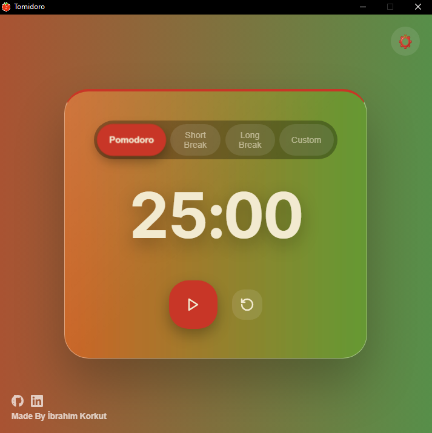
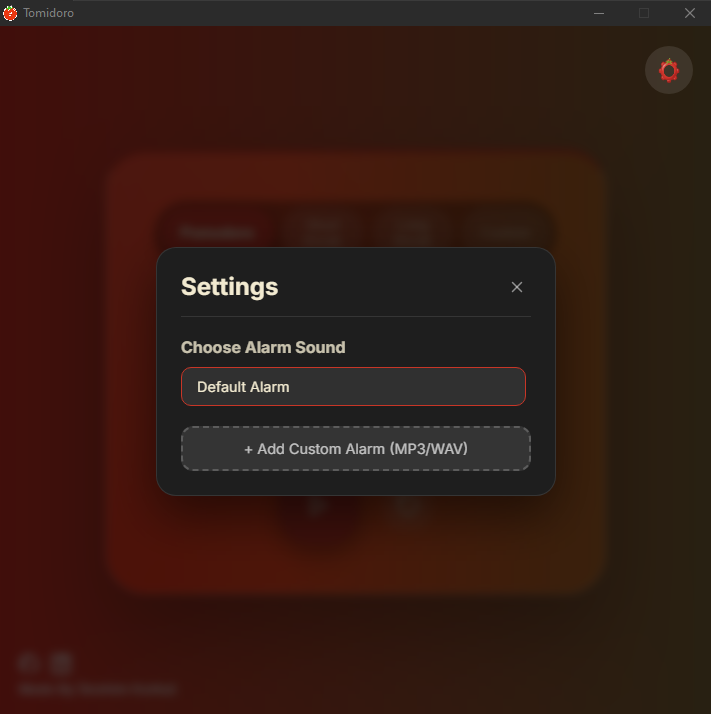

# 🍅 Tomidoro

Tomidoro, modern tasarımı ve kullanıcı dostu arayüzü ile odaklanmanıza yardımcı olan bir Pomodoro zamanlayıcısıdır. Electron ve React kullanılarak geliştirilmiştir.



## ✨ Özellikler

- **Modern Tasarım**: Glassmorphism ve canlı renk geçişleri ile şık bir görünüm.
- **Esnek Modlar**: Pomodoro, Kısa Mola (Short Break), Uzun Mola (Long Break) ve Özel (Custom) modları.
- **Sesli Uyarı**: Süre bittiğinde sizi uyaran alarm sistemi.
- **Ayarlanabilir Zamanlayıcı**: İhtiyacınıza göre süreleri özelleştirebilme.
- **Cross-Platform**: Windows üzerinde çalışan masaüstü uygulaması.

## 🚀 Kurulum ve Çalıştırma

Projeyi yerel makinenizde çalıştırmak için aşağıdaki adımları izleyin:

### Gereksinimler

- [Node.js](https://nodejs.org/) (v16 veya üzeri önerilir)
- npm veya yarn

### Adımlar

1. Depoyu klonlayın:
   ```bash
   git clone https://github.com/ibrahimkorkut/Tomidoro.git
   cd Tomidoro
   ```

2. Bağımlılıkları yükleyin:
   ```bash
   npm install
   ```

3. Geliştirme modunda çalıştırın:
   ```bash
   npm run dev:electron
   ```

### Build (Derleme)

Uygulamayı bir `.exe` dosyası haline getirmek için:
```bash
npm run dist
```
Çıktılar `dist_electron` klasöründe yer alacaktır.

## 🛠️ Kullanılan Teknolojiler

- **Frontend**: React, Vite
- **Desktop**: Electron
- **Styling**: Vanilla CSS (Modern CSS Properties)
- **Linting**: ESLint

## 📸 Ekran Görüntüleri



## 👤 Yapımcı

- **İbrahim Korkut** - [GitHub](https://github.com/ibrahimkorkut) | [LinkedIn](https://www.linkedin.com/in/ibrahimkorkut/)

---
*Made with ❤️ by ibrahim korkut*
